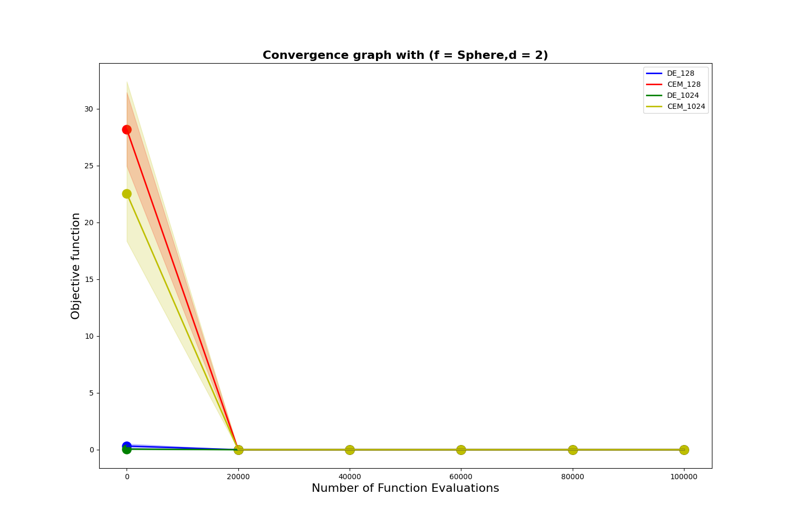

# Differential Evolution (DE) and Cross Entropy Method (CEM)
We install Differential Evolution (DE) and Cross Entropy Method (CEM)
Improved version to optimize the following objective functions:
1. f1: Sphere (d = 2 variables and 10 variables).
2. f2: Zakharov (d = 2 variables and 10 variables).
3. f3: Rosenbrock (d = 2 variables and 10 variables).
4. f4: Michalewicz (d = 2 variables and 10 variables).
5. f5: Ackley (d = 2 variables and 10 variables).

Information about these functions: formula of objective function, domain of value (search domain), global minima, you can refer to the following link:
[here](https://www.sfu.ca/~ssurjano/optimization.html)

### You do the following experiment:
- Population size N (or ) = 32, 64, 128, 256, 512, 1024
- For each case (f,d,N), we need to run the experiment 10 times, using different random seeds
- Each time the experiment runs, the algorithm stops immediately after 100,000 times (for d=2)
or 1,000,000 times (for d=10) the fitness evaluation function is called.
You save information about **the best solution $best_i$ and the value of the objective function( $𝑏𝑒𝑠𝑡_{i}$ )**
that DE and CEM find **at each generation i and the number of evaluation function calls
(num_of_evaluations)** used from the beginning of the experiment to the end of the generation this thing
- For each combination (f, d), draw a convergence graph: the vertical axis of the function value.
the target 𝑓𝑖𝑡𝑛𝑒𝑠( $𝑏𝑒𝑠𝑡_i$) saved as above, the horizontal axis is the number of calls to the evaluation function (from 0 to
100,000 or 1,000,000) like the following illustration. Note: just choose 2
case N=128 and 1024 of DE and CEM for easy viewing. The line in the middle is
average value over 10 runs, and error bars are +/- 1 std. Can draw
error bar with fill_between.



- You make a statistical table for the final result as follows for each combination (f, d).

| Popsize N / λ | CE | CEM |
| :---: | :---: | :---: |
| 32 | Mean (std) | Mean (std) |
| 64 | Mean (std) | Mean (std) |
| 128 | Mean (std) | Mean (std) |
| 256 | Mean (std) | Mean (std) |
| 512 | Mean (std) | Mean (std) |
| 1024 | Mean (std) | Mean (std) |

**Mean**: Average objective value of the best solution over 10 runs for the combination
(f,d) respectively.

**std**: Standard deviation of the objective value of the best solution over 10 runs for the group
match (f, d) respectively.

**_It is necessary to check the t-test statistical significance of the results and better highlight the results (cost
mean less) in each case._**

### How to run the code
you just need to do the following steps
```
git clone https://github.com/UIT-20521888/Lab3.git
cd Lab3
```
- if you just run but don't want to generate gif file then type the following command:
```
python3 run.py
```
- if you just run and generate the gif file then type the following command:
```
bash run.sh
```
----------------------------------------------------------------
After running either of the above commands, it will create the following directories:
- Foder File_imgage: contains a convergent graph
- Foder File_log: Contains information about the best bodies in each generation
- Foder File_result: Statistical table when running the algorithm with populations of different sizes
- Foder File_gif: Contains information of all instances at each generation (only available when pop size = 32)
- Foder File_save: contains gif files (only available when run command 'bash run.sh')
